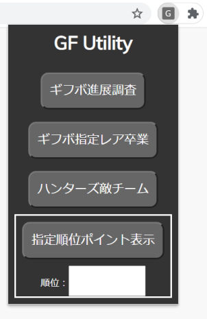
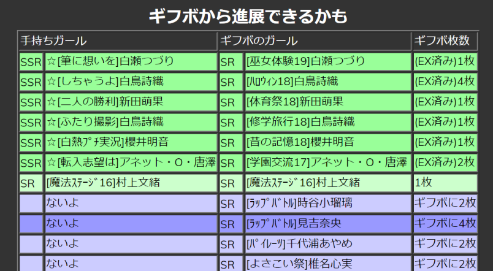
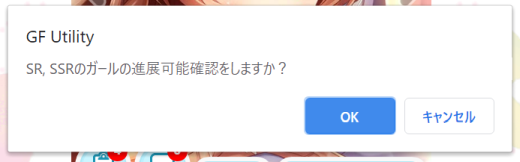
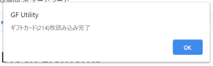
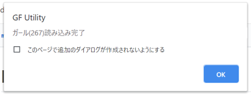
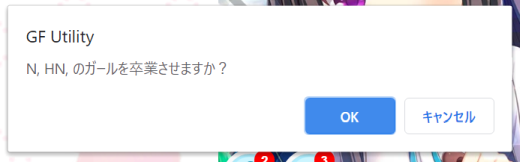
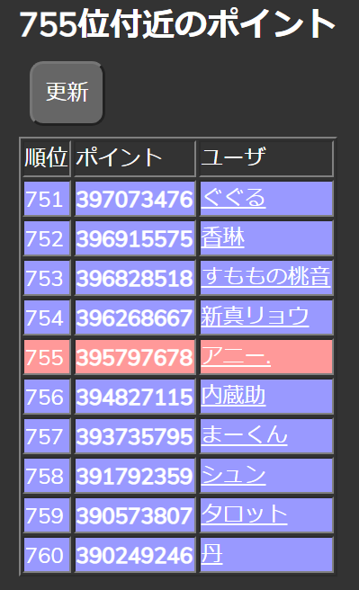

# 使用方法
 表示メニュー  
 * 拡張機能の「G」をクリックすると、メニューが出てきます。  
     
 本ツールでは、以下の機能を提供します。それぞれ、説明を記載します。  
 * ギフボの「HR,SR,SSR」と手持ちのガールを比較して「進展できるもの」、「EXまで進んでるもの(卒業しても悔いはないもの)」を調べます
 * ギフボの「特別進展ガール以外」のN,HN,Rを卒業させます
 	* ギフボ項目のレアリティは[オプション項目](option.md)で変更が可能です  
 * 現在進行中のイベントで、指定順位の獲得ポイントを表示します

## 最初に

 * **複数垢を持っている場合**、拡張機能の「詳細」を選択して、「シークレットモードでの実行を許可する」をONにしてください
 * シークレットモードでは、そのモードでログインしている垢に対して処理が有効になります。
 

## カード進展調査
**作った理由：SRバッジが欲しくて重複カード一覧が取得したかった**  

表示結果  
   
 * 手持ちのカードとギフボのカードで(EX)進展できるものの一覧を表示します
 * **EX進展済みで、ギフボにあるSR/SSRカードを併記します(＝卒業させても悔いがないカード)**
 * ギフボ内のみで進展可能なものを一覧で表示します

### 使用方法

 1. 「ギフボSR進展調査」をクリックします。
 1. 直後に、以下のようにレアリティチェックの画面が出ます
 	* ダイアログの内容が設定と一致しているか確認してください。間違っていたら、キャンセルしてください
 	* 表示されない場合、呼び出し失敗していますので、再度メニューを実行してください
    
 1. そのあと、2回、アラートが表示されます  
    
    
 1. 2回終わると、画面表示が代わります。
  出てきた内容をもとに、ギフトボックスを検索して進展や卒業などにご利用ください

## ギフボ指定レア卒業
**作った理由：手作業が面倒くさかった**  
  
 1. 「ギフボ指定レア卒業」をクリックしてください。
 1. 直後に、以下のようにレアリティチェックの画面が出ます
 	* ダイアログの内容が設定と一致しているか確認してください。間違っていたら、キャンセルしてください
 	* 表示されない場合、呼び出し失敗していますので、再度メニューを実行してください
    
 1.  ギフボから特別指導ガールを除くN/HNが卒業されます
	* 手元のひ弱なPCでも、1秒で20人程度卒業できます

## ハンターズ中全相手チームメンバ表示
**作った理由：知りたかった**  

 1. 「vcard.ameba.jp/raidwar?eventId=91」のように、eventIdと「raidwar」がURLにあるページを表示してください
	* ページ内ソースを解析しないように、URLだけで判定するようにしたため。
 1. メニュー「ハンターズ相手チーム」を押下してください
 1. 画面に結果が表示されます

## イベント中ランキング表示
**作った理由：1000位争いなどボーダー争ってるときに更新できるポイント確認画面が欲しかった**  

 1. 「vcard.ameba.jp/raid?eventId=91」のように、eventIdとイベント名(raidやraidwar)がURLにあるページを表示してください
	* ページ内ソースを解析しないように、URLだけで判定するようにしたため。
 1. メニューにあるテキストボックスに表示したい順位を入力します
 1. 「イベント中ランキング」 ボタンを押します
 1. 画面に結果が表示されます
	* 画面左上の「更新」をクリックすると、順位は変わらず、ポイントだけ更新します。
   
