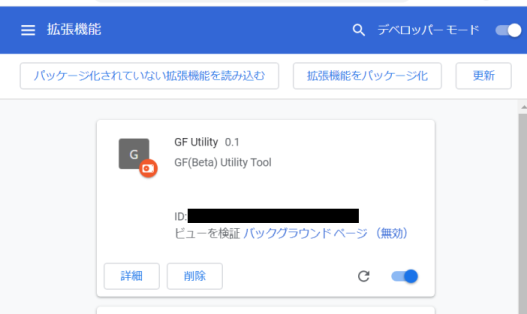

# 使用方法

 本ツールでは、以下の機能を提供します。それぞれ、説明を記載します。
 * ギフボの「SR,SSR」と手持ちのガールを比較して「進展できるもの」、「EXまで進んでるもの(卒業しても悔いはないもの)」を調べます
 * 「特別進展ガール以外」のNとHNを卒業させます
 * 現在進行中のイベントで、指定順位の獲得ポイントを表示します

## 最初に

 * 複数垢を持っている場合、拡張機能の「詳細」を選択して、「シークレットモードでの実行を許可する」をONにしてください
 * シークレットモードでは、そのモードでログインしている垢に対して処理が有効になります。
 

## SR/SSR進展調査

表示結果
 * 
 * 手持ちのカードとギフボのカードで(EX進展)できるものの一覧を表示します
 * EX進展済みで保持しているSR/SSRカードを、進展済みのカードと併記します  (卒業させても悔いがないカード)
 * ギフボ内のみで進展可能なものを一覧で表示します

### 使用方法

