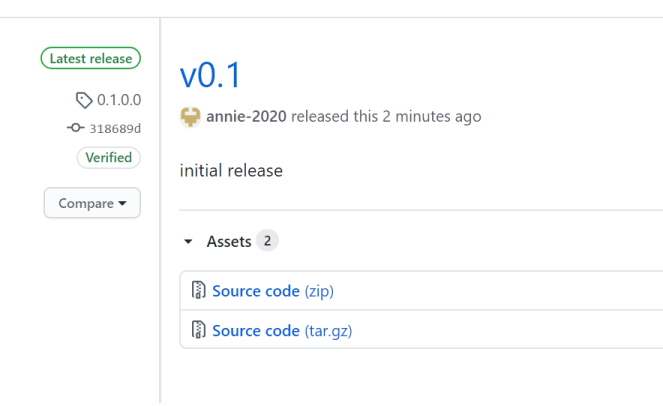
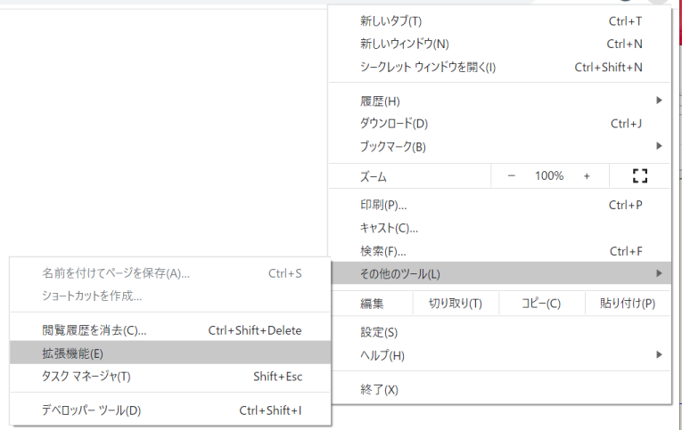
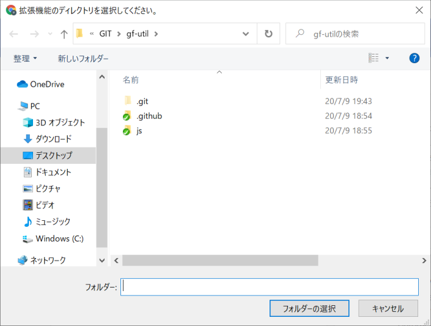
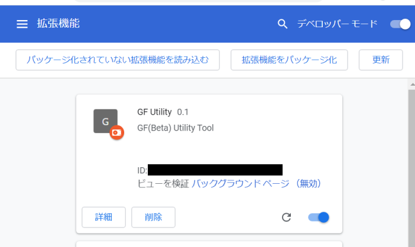

# インストール方法

 本ツールはChromeブラウザの拡張機能として動作します  
 拡張機能ページからのダウンロードおよびインストールは[こちら](https://chrome.google.com/webstore/detail/gf-utility/nffeeheaccmggkehefnogfaekoaagppb/related?hl=ja)から。

 デベロッパー機能から、コードレベルの登録については、本ページで説明します。  
 ※ [注意事項](warning.md)参照  

## ダウンロード

 1. GITHUBの使い方
	1. GITHUBの対象ページに移動します (2020/7/28 時点。ver 0.3.1.0)
		- [対象ページ](https://github.com/annie-2020/gf-util/releases/tag/0.3.1.0)
	2. 「Source Coude(zip)」 をクリックします
		- 
	3. ダウンロードしたものを展開して、適当な場所に置きます

## インストール

 1. CHROMEの設定方法
	1. CHROMEを開き、「メニュー」->「その他のツール」->「拡張機能」 をクリックします。
		- 
	2. デベロッパーメニューをONにして、「パッケージ化されていない拡張機能を読み込む」を押下します。
		- 
	3. 解凍したフォルダ内にある「js」フォルダが見えるパスで「フォルダーの選択」を押下してください
		- 
	4. 以下のように拡張機能一覧に表示されます
		- 

続けて使用方法は[使用方法](howtouse.md)で確認してください
