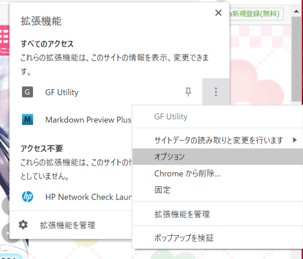
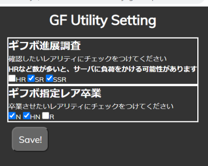

# オプション項目

ギフボに関する項目は、レアリティを変更できます。  

## オプション表示方法

     

 * 「G」の上で右クリック、若しくは画像のように、右の三点ボタンから「オプション」をクリックしてください  
 * ブラウザ上にオプション画面が表示されます

## オプション内容

     

オプションは以下の通りです  
設定終了したら、画面下の「SAVE」を押してください  

 1. 進展チェック
	- HR/SR/SSRの選択ができます。デフォルトは「SR/SSR」です
	- ギフボを検索する項目にチェックを付けます。ガールは、その進展可能な対象を検索します
		- HRをチェックすると、ギフボ内はHR、ガールからは進展可能なHR/SRを対象に処理を行います
 1. 自動卒業
	- N/HN/Rの選択ができます。デフォルトはN/HNです
		- どれを選択しても、特別指導ガールは対象外です

## オプションの保存

 * オプションの項目は保存されます。
 	 * シークレットモードの場合、ブラウザを閉じると保存されます
 	 * 通常のブラウザの場合、拡張機能から削除すると保存情報も消えます
